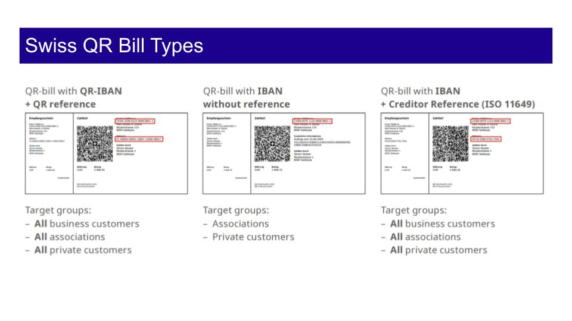
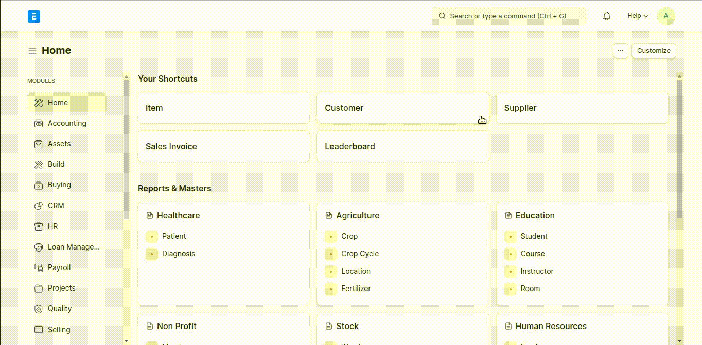
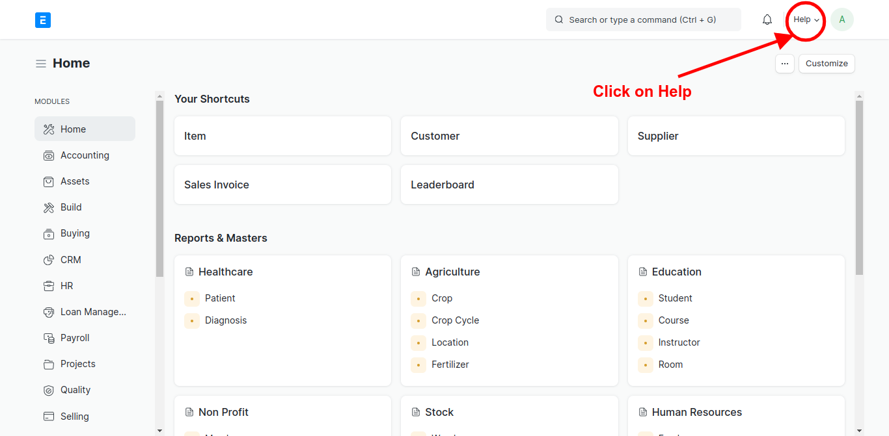

# Swiss ERPNext

**Swiss ERPNext** is a customization of [erpnext](https://erpnext.com/) for switzerland opensourced by [grynn](https://grynn.ch). It contains features that makes [erpnext](https://erpnext.com/) usable for the Swiss market. Customizations are created With flexibility in mind so you can pick any of the customization and works independently. Eg. You can only Install out app that Creates QRBILL without installing the whole suite. Customizations are as follows

1. [Swiss-E-invoicing-ERPNext](https://github.com/Grynn-GmbH/Swiss-E-invoicing-ERPNext) : Swiss E Invoicing PDF For ERPNEXT by Grynn
2. [Swiss-QR-Bill-ERPNext](https://github.com/Grynn-GmbH/Swiss-QR-Bill-ERPNext) : Swiss QR Bill by Grynn
3. [ESTV-SuisseTax-FX](https://github.com/Grynn-GmbH/ESTV-SuisseTax-FX) : Automated Daily & Monthly Import of FX Rates


## Swiss-E-invoicing-ERPNext

Swiss-E-Invoicing-ERPNext is a App/Plugin for creating E-invoicing as you create sales invoice. with this app/plugin you can automatically create **E-Invoice PDF** and attach it to your **Sales Invoice**. It creates a machine readable XML as per standard FACTUR-X and creates a standard bill as per your default sales invoice template and then creates the attachment.

### Installation (Frappe Cloud) 

Check with FrappeCloud documentation.

### Installation (For Developers)

```sh
$ cd <your-bench-directory>
$ bench get-app swiss_factur_x_e_invoicing https://github.com/Grynn-GmbH/Swiss-E-invoicing-ERPNext
$ bench --site <your-site> install-app swiss_factur_x_e_invoicing
$ bench restart
```

### Prerequisite / Settings

There are a few prerequisite to this application 

1. Frappe & ERPNext needs to be installed
2. Company which is generating "Sales Invoice" MUST have the "Address" doctype assigned to it.

##### For assigning Address to Company Doctype


## usage
Using Swiss-E-Invoice-ERPnext is fully automated. When a Sales Invoice is created & submitted, a PDF/A3 with e-invoice XML is generated and attached to Sales Invoice.

---

##  Swiss QR Bill for ERPNext

Grynn has developed a QR Bill Generator app (Free and Open Source) that works seemlessly with ERPNext. The Swiss QR Bill can be used in 3 different ways. We have implemented the general version for IBAN, without Reference. 

### Installation (Frappe Cloud) 

Check the documentation on frappecloud.com

### Installation (For Developers)

```sh
$ cd <your-bench-directory>
$ bench get-app grynnswissqrbill https://github.com/Grynn-GmbH/Swiss-E-invoicing-ERPNext
$ bench --site <your-site> install-app grynnswissqrbill
$ bench restart
```

### Prerequisite / Settings

There are a few prerequisite for the application as follows

1. Frappe & ERPNext is installed 
2. The Company Country should be Switzerland. If a company is create with India or another country, then this APP will ignore QR code app.
3. The Currency of Sales Invoice should be either `CHF` or `EUR`. Else it will not create QR bill. This is as per the standards. 
4. The QR Bill is created in the Customer Language (EN/DE/FR/IT). If no language is set, then DE is the default. 

### Usage

Using Swiss-QR-Bill-ERPNext is fully automated. A QR Bill is generated and attached to the "Sales Invoice" doctype when Sales Invoice is "Submitted".

---

## ESTV-SuisseTax-FX

ESTV-SuisseTax-FX is a cron/scheduled application which daily updates your exchange rate with other currencies. It uses Exchange Rate Provided [Here](https://www.backend-rates.ezv.admin.ch/api/xmlavgmonth) to Fetch daily and monthly exchange rates. 

### Installation (Frappe Cloud) 

....

### Installation (For Developers)

```sh
$ cd <your-bench-directory>
$ bench get-app estv_suissetax_fx https://github.com/Grynn-GmbH/Swiss-E-invoicing-ERPNext
$ bench --site <your-site> install-app estv_suissetax_fx
$ bench restart
```

### Prerequisite / Settings

1. Frappe / ERPPNext should be installed
2. Currencies which are enabled are the only ones for which FX rates are entered everyday
3. Enable the currency you want as shown below. 



### Usage

Using ESTV-SuisseTax-FX is fully automated. Once installed, the FX rates are downloded everyday and entered into ERPNext. 

---

### How to check whether an  APP is installed. 

#### Step 1: 

Click on ERPNext Logo and Go to your Homepage of Desk


#### Step 2:



#### Step 3: 

Click On About


#### Step - 4 

In about section it should show the installed apps with their versions. Like Here Estv Suissetax FX, Grynnswissqrbill & Swiss Factur X E Invoicing is installed in our site


## License

Every App/Plugin are provided under [GPLV3](https://en.wikipedia.org/wiki/GNU_General_Public_License) License and swisserpnext is developed and maintained by  [Grynn GmbH](https://grynn.ch)


## Requirements

To use these customizations you need [erpnext](https://github.com/frappe/erpnext) & Frappe installed. 

## Privacy
All the App/Plugin Created for ERPNext by Grynn does not Take any of Your Data. 
Privacy is a key factor for grynn and every software provided for customization ensures privacy.

## Contributions
Contributions to any of our applications are welcome. 

## Issues
Issues specific to app/plugin can be found as follows, these issues mean known bugs to a specific application. This medium is specifically used to file any malfunction of software

1. [ Swiss-E-invoicing-ERPNext Issues](https://github.com/Grynn-GmbH/Swiss-E-invoicing-ERPNext/issues) 
2. [Swiss-QR-Bill-ERPNext Issues](https://github.com/Grynn-GmbH/Swiss-QR-Bill-ERPNext/issues) 
3. [ESTV-SuisseTax-FX Issues](https://github.com/Grynn-GmbH/ESTV-SuisseTax-FX/issues) 


## Contact

If you would like us to implement the other two types, kindly get in touch with us. sales@grynn.ch. 

## Grynn's Mission : Promote & Implement ERPNext for Swiss Companies

Grynn GmbH loves, implements & promotes ERPNext in Switzerland, Germany, Eastern Europe and India. 

Founded in 2017 by Deepak Pai in order to help companies with their digital transformation journey. He has 2 decades of IT and Finance & has worked for companies such as Bank of America, Unilever and Ecolab. He is an MBA graduate of St. Gallen University (Switzerland) and alumnus of MIT Manipal. He is a certified digital strategist from MIT/Emeritus & consults for F500 companies.

---

## Grynn and Open Source

Grynn is an advocate of using Free and Open Source Software (FOSS). ERPNext is world's #1 ERP system that is 100% FOSS. 
Grynn from time to time contributes to the ERPNext ecosystem by developing Open Source applications such as Swiss QR Bill. 

---

### Logo and Trademark

The brand Grynn and the logo are trademarks for Grynn GmbH.
