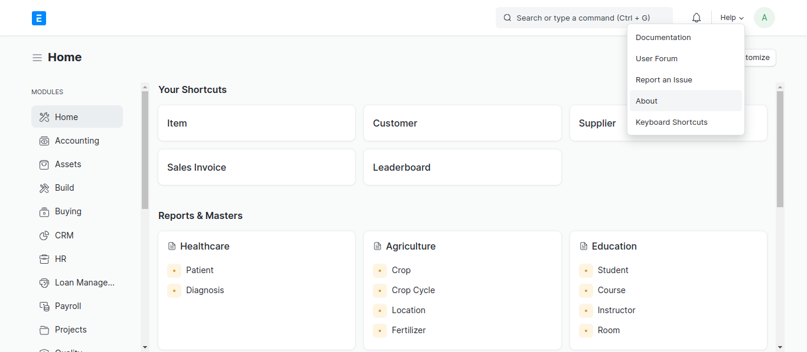

# SwissERPNext 

**swisserpnext** is a customization of [erpnext](https://erpnext.com/) for switzerland opensourced by [grynn](https://grynn.ch). It Contains Features That Makes [erpnext](https://erpnext.com/) Usable for Switzerland Market. Customizations are Created With flexibility in Mind so you can Pick any of the Customization without Worrying About Other. Eg. You can only Install out app that Creates QRBILL without installing the whole suite. Customizations are as follows

1. [ Swiss-E-invoicing-ERPNext](https://github.com/Grynn-GmbH/Swiss-E-invoicing-ERPNext) : Swiss E Invoicing PDF For ERPNEXT by Grynn
2. [Swiss-QR-Bill-ERPNext](https://github.com/Grynn-GmbH/Swiss-QR-Bill-ERPNext) : Swiss QR Bill by Grynn
3. [ESTV-SuisseTax-FX](https://github.com/Grynn-GmbH/ESTV-SuisseTax-FX) : ERPNext for Switzerland By Grynn - Automated Daily & Monthly Import of FX Rates


## Swiss-E-invoicing-ERPNext

Swiss-E-Invoicing-ERPNext is a App/Plugin for creating E-invoicing as you create sales invoice. with this app/plugin you can automatically create **E-Invoice PDF** and attach it to your **Sales Invoice**. It creates a machine readable XML as per standard FACTUR-X and creates a standard bill as per your default sales invoice template and then creates the attachment.

### Installation (Frappe Cloud) 

....

### Installation (For Developers)

```sh
$ cd <your-bench-directory>
$ bench get-app grynnswissqrbill https://github.com/Grynn-GmbH/Swiss-E-invoicing-ERPNext
$ bench --site <your-site> install-app grynnswissqrbill
$ bench restart
```

### Checking Installation

#### Step 1: 

Click on ERPNext Logo and Go to your Homepage of Desk


#### Step 2:


#### Step 3: 

Click On About

