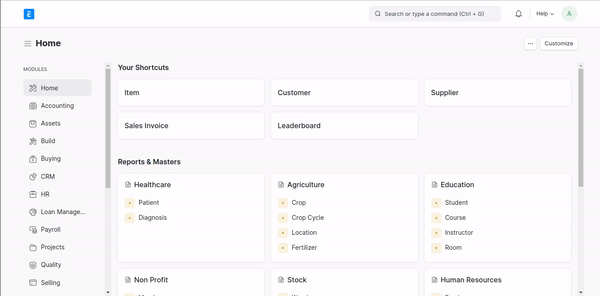
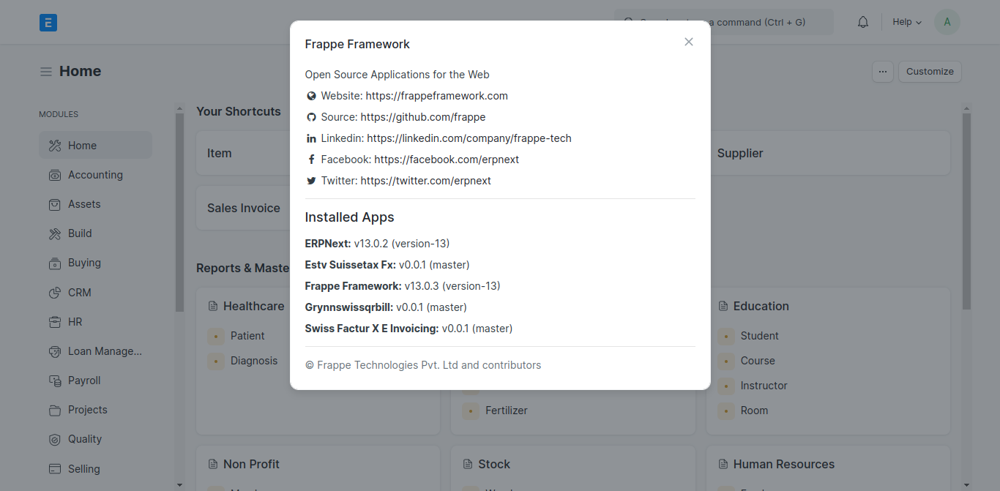

# erpnextswiss 

**erpnextswiss** is a customization of [erpnext](https://erpnext.com/) for switzerland opensourced by [grynn](https://grynn.ch). It Contains Features That Makes [erpnext](https://erpnext.com/) Usable for Switzerland Market. Customizations are Created With flexibility in Mind so you can Pick any of the Customization without Worrying About Other. Eg. You can only Install out app that Creates QRBILL without installing the whole suite. Customizations are as follows

1. [ Swiss-E-invoicing-ERPNext](https://github.com/Grynn-GmbH/Swiss-E-invoicing-ERPNext) : Swiss E Invoicing PDF For ERPNEXT by Grynn
2. [Swiss-QR-Bill-ERPNext](https://github.com/Grynn-GmbH/Swiss-QR-Bill-ERPNext) : Swiss QR Bill by Grynn
3. [ESTV-SuisseTax-FX](https://github.com/Grynn-GmbH/ESTV-SuisseTax-FX) : ERPNext for Switzerland By Grynn - Automated Daily & Monthly Import of FX Rates


## Swiss-E-invoicing-ERPNext

Swiss-E-Invoicing-ERPNext is a App/Plugin for creating E-invoicing as you create sales invoice. with this app/plugin you can automatically create **E-Invoice PDF** and attach it to your **Sales Invoice**. It creates a machine readable XML as per standard FACTUR-X and creates a standard bill as per your default sales invoice template and then creates the attachment.

### Installation (Frappe Cloud) 

....

### Installation (For Developers)

```sh
$ cd <your-bench-directory>
$ bench get-app grynnswissqrbill https://github.com/Grynn-GmbH/Swiss-E-invoicing-ERPNext
$ bench --site <your-site> install-app grynnswissqrbill
$ bench restart
```


### Prerequisite / Settings

There are no Prerequisite to this application but it is good to have following settings.

1. Company Generating Sales Invoice have Address Assigned to it.

##### For Assigning Address to Company 



## usage

Using Swiss-E-Invoice-ERPnext is fully automated, you just need to create a Sales Invoice and It Generates the PDF


## Swiss-QR-Bill-ERPNext


## ESTV-SuisseTax-FX

ESTV-SuisseTax-FX is a cron/scheduled application which daily updates your exchange rate with other currencies.


## Check Installed Applications

#### Step 1: 

Click on ERPNext Logo and Go to your Homepage of Desk


#### Step 2:


#### Step 3: 

Click On About


#### Step - 4 

In about section it should show the installed apps with their versions. Like Here Estv Suissetax FX, Grynnswissqrbill & Swiss Factur X E Invoicing is installed in our site




## License

Every App/Plugin are provided under [GPLV3](https://en.wikipedia.org/wiki/GNU_General_Public_License) License and swisserpnext is developed and maintained by  [Grynn](https://grynn.ch)


## Requirements

To use these customizations you need [erpnext](https://github.com/frappe/erpnext) & That is the only requirement.


## Privacy

All the App/Plugin Created for ERPNext by Grynn does not Take any of Your Data. Privacy is a key factor for grynn and every software provided for customization ensures privacy.


## Contributions

Contributions to any of our applications are welcome. 


## Issues

issues specific to app/plugin can be found as follows, these issues mean known bugs to a specific application. this medium is specifically used to file any malfunction of software

1. [ Swiss-E-invoicing-ERPNext Issues](https://github.com/Grynn-GmbH/Swiss-E-invoicing-ERPNext/issues) 
2. [Swiss-QR-Bill-ERPNext Issues](https://github.com/Grynn-GmbH/Swiss-QR-Bill-ERPNext/issues) 
3. [ESTV-SuisseTax-FX Issues](https://github.com/Grynn-GmbH/ESTV-SuisseTax-FX/issues) 

## Contact

...


## About Grynn

...